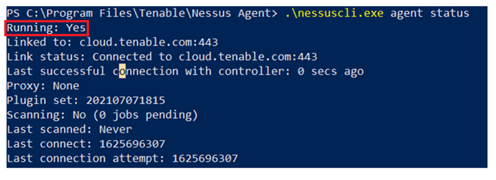

## Tenable Agent Deployment for Tenable.IO Scanning  
#### Deployment  

1.  Navigate to https://www.tenable.com/downloads/nessus-agents and download the appropriate agent for your environment.

2.  Push the agent to all target devices (Often workstations and laptops).  

3.  Request the linking script from CND staff and run the provided script in PowerShell as an administrator. If you do not have contact information for your lead Risk Analyst, contact Info@cnd.ca.gov.  

4.  To verify the Tenable agent is running and linked, run the command below on any host.
 ```
.\\nessuscli.exe agent status
```  

