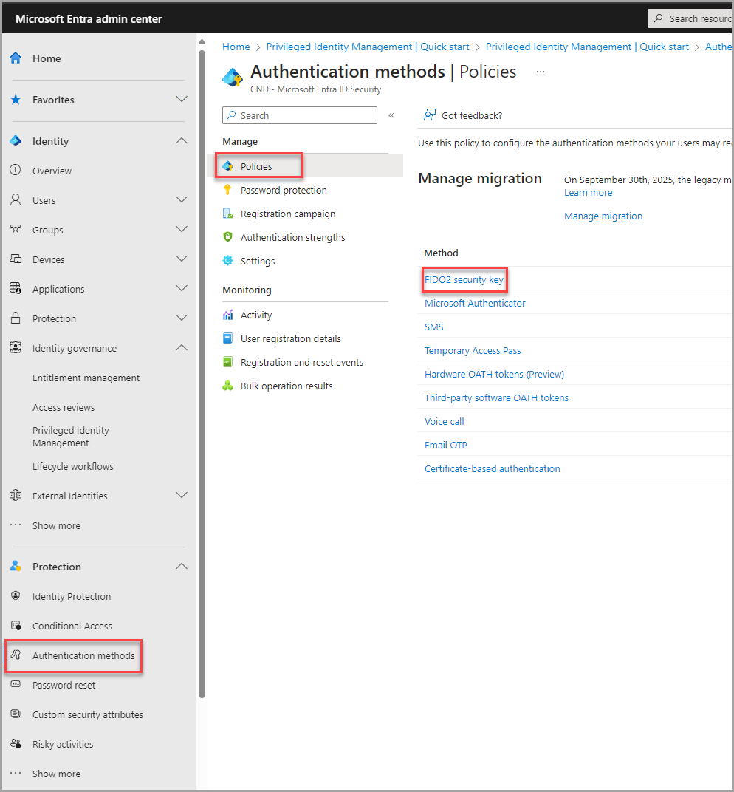
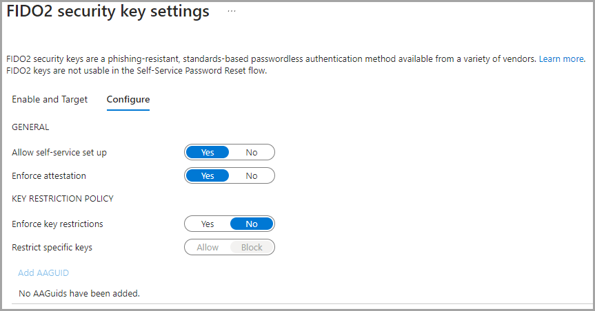
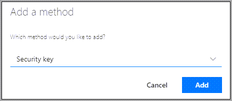
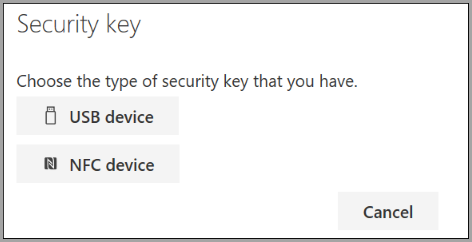
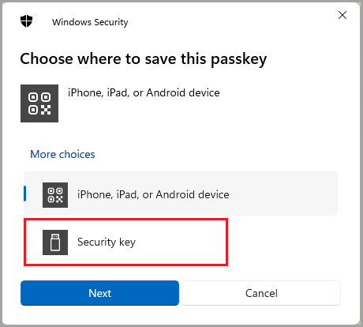
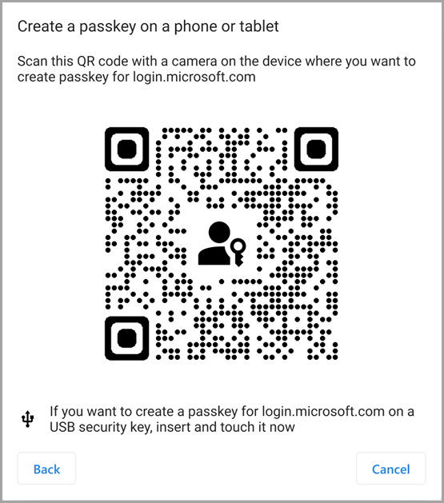
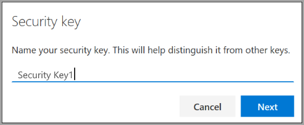
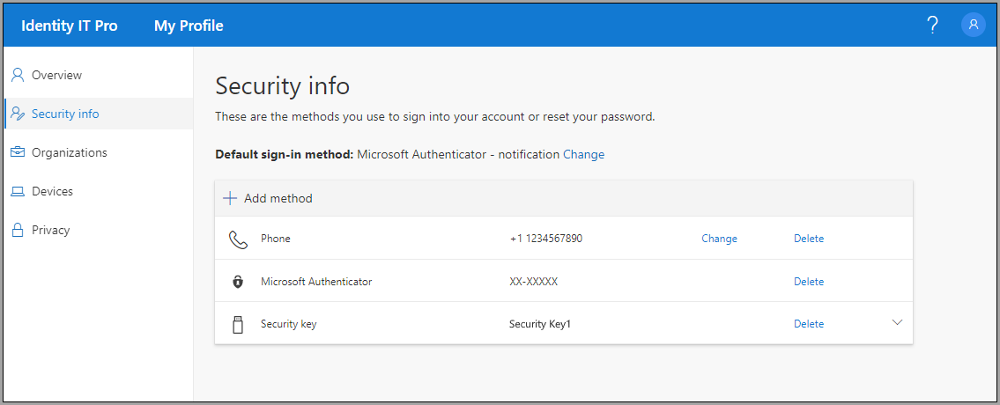

### Microsoft 365 Set up Synchronizing Between Tenants  
---

* [Step 1 Setup Multi-Tenant Organization](https://learn.microsoft.com/en-us/microsoft-365/enterprise/set-up-multi-tenant-org?view=o365-worldwide#set-up-a-new-multitenant-organization)  
* [Step 2 Add New Tenant to Multi-Tenant Organization](https://learn.microsoft.com/en-us/microsoft-365/enterprise/set-up-multi-tenant-org?view=o365-worldwide#add-a-tenant-to-your-multitenant-organization)  
* [Step 3 Sync Users Multi-Tenant Organization](https://learn.microsoft.com/en-us/microsoft-365/enterprise/sync-users-multi-tenant-orgs?view=o365-worldwide) 

### Register YubiKey Devices (admin’s part)  
---  

1.  Sign in to [Microsoft Entra Admin Center](https://entra.microsoft.com/#view/Microsoft_AAD_IAM/AuthenticationMethodsMenuBlade/~/AdminAuthMethods/fromNav/)  

2.  In the left-hand navigation menu, go to **Protection** > **Authentication mentods** > **Policies** and click **FIDO2 security key.**  

      

3.  On the **Enable and Target** tab, set the switch to **Enable** and choose the users who will be able to register and use security keys. You can select **All users** or add specific groups. By clicking the **Exclude** tab, you can choose the groups whose members won’t be able to use a YubiKey.

4.  The Configure tab offers more advanced options:  
    * Allow self-service set up – lets a user register a key through the MySecurityInfo portal by themselves. Enabling this option is required if you want to allow your users to register YubiKey devices.  
    * Enforce attestation – when set to Yes, lets you additionally verify a security key for metadata using the FIDO Alliance Metadata Service and additional tests by Microsoft.  
    * Enforce key restrictions – when set to Yes, your users will be able to register only those keys that have a specific Authenticator Attestation GUID (AAGUID). You can also block the use of keys with a specific AAGUID.  

         

5.  Finally, click Save at the bottom of the window to apply your changes.  

### YubiKey configuration in Microsoft 365 (user’s part)  
---  

You must create your security key and give it a unique PIN before you can sign in to your work or school account using the key. You may have up to 10 keys registered with your account.  

1.  Go to the My Profile page at [My Account](https://myaccount.microsoft.com) and sign in if you haven't already done so.  
    
2.  Select **Security Info**, select **Add method**, and then select **Security key** from the **Add a method** list.  
      
      
    
3.  Select **Add**, and then select **USB** device.  
      
       
    
4.  Make sure that you have your security key physically available, and then on the **Security key** page, select **Next**.  
      
     
    
5.  In the **Setting up your new sign-in method** page, select **Next**, and then:  
    
    *   If your security key is a USB device, insert your security key into the USB port of your device.  
        
    *   If your security key is an NFC device, tap your security key to your reader.  
        
    
6.  If you're using Chrome or Edge, the browser might prioritize registration of a passkey that's stored on a mobile device over a passkey that's stored on a security key.  
    
    *   Beginning with Windows 11 version 23H2, you can sign in with your work or school account and click **Next**. Below **More choices**, choose **Security key** and click **Next**.  
          
          

    *   On earlier versions of Windows, the browser may show the QR pairing screen to register a passkey that's stored on another mobile device. To register a passkey that's stored on a security key instead, insert your security key and touch it to continue.  

          
        
    
7.  Type your unique security key PIN into the Windows security box, and then select **OK**. You'll return to the **Setting up your new sign-in method** box.  
    
8.  Select **Next**.  
    
9.  Return to the **Security info** page, type a name you'll recognize later for your new security key, and then select **Next**.  
      
      
    
10.  Select **Done** to close the **Security key** page. The **Security info** page is updated with your security key information.  
      
      

### References  
#### [Inter Tenant Collaboration](https://learn.microsoft.com/en-us/microsoft-365/enterprise/microsoft-365-inter-tenant-collaboration?view=o365-worldwide)   
#### [How to deploy YubiKey in Microsoft 365](https://www.codetwo.com/admins-blog/yubikey-setup-microsoft-365)  
#### [Setup Security Key as Validation](https://support.microsoft.com/en-us/account-billing/set-up-a-security-key-as-your-verification-method-2911cacd-efa5-4593-ae22-e09ae14c6698)  
