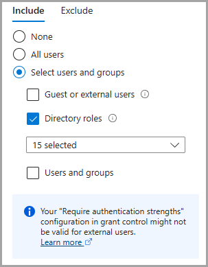
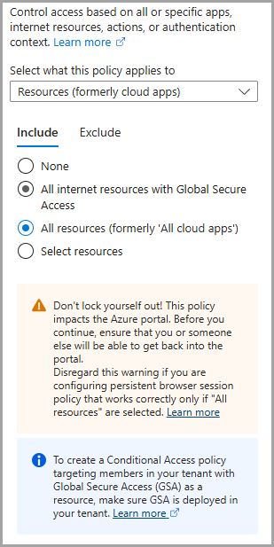
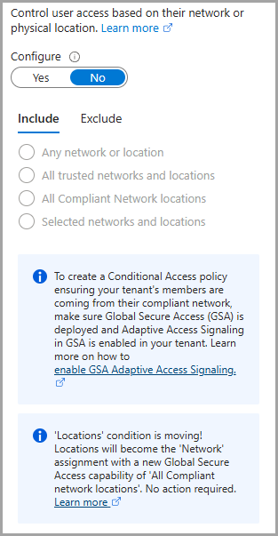
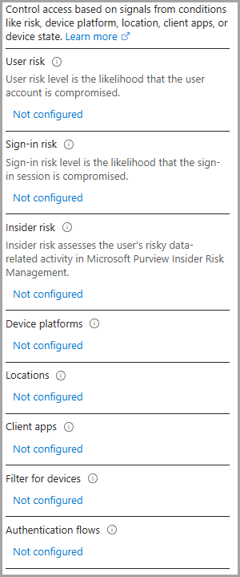
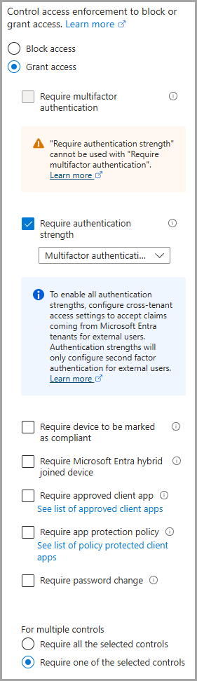
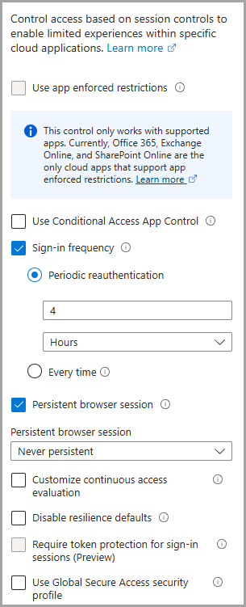

## Conditional Access Persistent Browser Sessions  
Implementing a Conditional Access policy to enforce session timeouts for authentication is a critical security best practice in Microsoft 365 environments. By limiting the duration of authenticated sessions, you reduce the window of opportunity for unauthorized access in cases where credentials are compromised or sessions are left unattended. Session timeouts help ensure that users must periodically reauthenticate, reinforcing identity verification and reducing the risk of persistent access by attackers using stolen tokens or devices. This approach aligns with the principles of Zero Trust by verifying trust continuously and limiting implicit trust over time, thereby strengthening your organization's overall security posture.  

### Assignments  
#### Users  
Identities in the directory that the policy applies to, including users, groups, and service principals.  
  

#### Target Resources  
Resources that the policy applies to, including apps, internet resources, actions, or authentication context.  
  

#### Network  
Network and locations (determined by IP address range or GPS coordinates) the user is signing in from.  Applies to everywhere if not configured.  
  

#### Conditions  
Conditions which define when the policy will apply. For example, 'location'.  

* User Risk - Configure user risk levels needed for policy to be enforced  
* Sign-in risk - Likelihood that the sign-in is coming from someone other than the user. Risk level can be high, medium or low. Requires Microsoft Entra ID P2 license.  
* Insider risk - Insider risk, configured in Adaptive Protection, assesses risk based on a user's risky data related activities.  
* Device platforms - Platform the user is signing in from. For example, 'iOS'.  
* Locations - Network and locations (determined by IP address range or GPS coordinates) the user is signing in from.  
* Client apps - Software the user is employing to access the cloud app. For example, 'Browser'.  
* Filter for devices - Filter to apply to devices based on their attributes.  
* Authentication flows - How your organization uses certain authentication and authorization protocols and grants.  
  

#### Grant  
Block access or select additional requirements which need to be satisfied to allow access.  
  

#### Session  
Session controls enable limited experience within a cloud app.  
  

## References  
[Microsoft Conditional Access Policies](https://learn.microsoft.com/en-us/entra/identity/conditional-access/)  