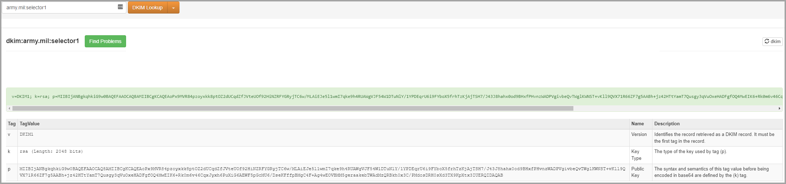

### Use email authentication to help prevent spoofing  
DMARC prevents spoofing by examining the From address in messages. The From address is the sender's email address that users see in their email client. Destination email organizations can also verify that the email domain has passed SPF or DKIM. In other words, the domain has been authenticated and therefore the sender's email address is not spoofed.

However, DNS records for SPF, DKIM, and DMARC (collectively known as email authentication policies) are optional. Domains with strong email authentication policies like microsoft.com and skype.com are protected from spoofing. But domains with weaker email authentication policies, or no policy at all, are prime targets for being spoofed.

Lack of strong email authentication policies is a large problem. While organizations might not understand how email authentication works, attackers fully understand and they take advantage. Because of phishing concerns and the limited adoption of strong email authentication policies, Microsoft uses implicit email authentication to check inbound email.

Implicit email authentication is an extension of regular email authentication policies. These extensions include: sender reputation, sender history, recipient history, behavioral analysis, and other advanced techniques. In the absence of other signals from these extensions, messages sent from domains that don't use email authentication policies will be marked as spoof.

To see Microsoft's general announcement, see [A Sea of Phish Part 2 - Enhanced Anti-spoofing in Microsoft 365](https://techcommunity.microsoft.com/t5/Security-Privacy-and-Compliance/Schooling-A-Sea-of-Phish-Part-2-Enhanced-Anti-spoofing/ba-p/176209)  

### Set up SPF to help prevent spoofing  
Use [Microsoft's instructions](https://learn.microsoft.com/en-us/microsoft-365/security/office-365-security/email-authentication-spf-configure?view=o365-worldwide#create-or-update-your-spf-txt-record) to setup SPF records for the organization.  

Organization only uses Microsoft Exchange Online for sending email.  
```
v=spf1 include:spf.protection.outlook.com -all
```  

Organization uses more than Microsoft for sending email, e.g. MailChimp, SalesForce and SendGrid.  
Use [MXToolBox SPF Generator](https://mxtoolbox.com/SPFRecordGenerator.aspx) to generate the TXT record.  

* microsoft.com example:  
```
v=spf1 include:_spf-a.microsoft.com include:_spf-b.microsoft.com include:_spf-c.microsoft.com include:_spf-ssg-a.msft.net include:spf-a.hotmail.com include:_spf1-meo.microsoft.com -all
```  

* state.ca.gov example:  
```
v=spf1 include:spf.protection.outlook.com ip4:216.52.6.89 ip4:156.60.157.112/28 ip4:134.186.201.240/28 ip4:156.60.5.32/28 ip4:161.149.240.176 ip4:149.72.229.14 -all
```  

* nsa.gov example:  
```
v=spf1 ip4:214.29.60.2/32 ip4:214.29.60.3/32 include:_spf.eemsg.mail.mil include:amazonses.com ~all
```  

Use [MXToolBox SuperTool](https://mxtoolbox.com/SuperTool.aspx) to validate SPF records.  

* dhs.gov example:  
```
v=spf1 ip4:216.128.251.155 ip4:128.129.88.18 a:mail.tripwire-dhs.us include:spf.dhs.gov include:spf.protection.outlook.com include:spf-00376703.gpphosted.com -all
```  


### Use DKIM to validate outbound email sent from your custom domain  
Use [Microsoft's instructions](https://learn.microsoft.com/en-us/microsoft-365/security/office-365-security/email-authentication-dkim-configure?view=o365-worldwide) to setup DKIM records for the organization.  

Use [MXToolBox SuperTool](https://mxtoolbox.com/SuperTool.aspx) to validate DKIM records.  

* army.mil example:  
```
army.mil:selector1
```  
```
army.mil:selector2
```  




### References  
[Exchange Online](https://learn.microsoft.com/en-us/exchange/exchange-online)  
[Exchange Online Protection](https://learn.microsoft.com/en-us/microsoft-365/security/office-365-security/email-authentication-about?view=o365-worldwide)  
[Define SPF Record](https://support.google.com/a/answer/10683907?sjid=14513075492794864441-NA)  