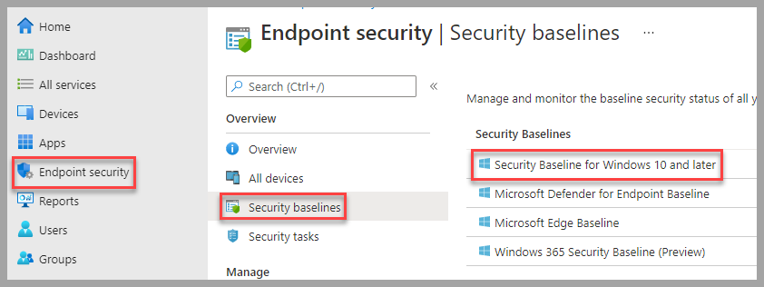
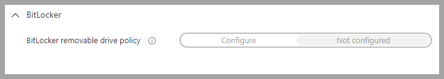
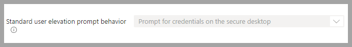
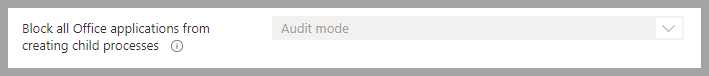
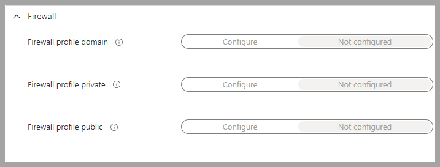
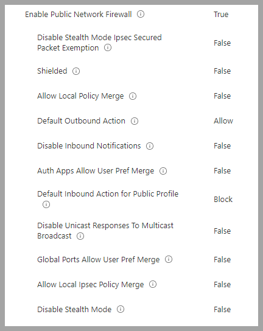
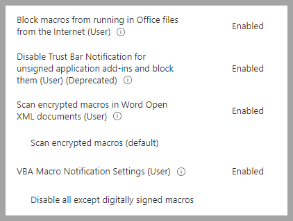
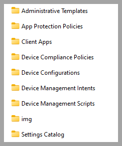

The goal of this document is to help implement the DoD/NIST security settings for Windows clients using Intune.  Along with this documentation are the Intune Backups that can be implemented in any organization.  The Intune Policies have been built from the Microsoft Security baselines and templates at the Department of Defense(DoD) Defense Information Systems Agency site(DISA).  The DoD provides a consolidated repository of these settings in its [DoD GPO Download](https://public.cyber.mil/stigs/gpo/).  The purpose of this repository was to upgrade to the newer `Settings Catalog` format and try and consolidate into fewer policies.  The reason for using the DISA site is the STIG Viewer and SCC SCAP tool.  These are easy to use tools for viewing, documenting and validating the DoD/NIST settings.  DoD has now also released the SCC SCAP tool to the public, which lets you scan a local or remote system for compliance.  See links in the [References Section](#references-home) to the guides and training videos for these tools.    

This is primarily designed for organizations that mange endpoints using Intune MDM and are only Azure registered or joined.  All of the policies referenced below have been provided in the backup and will be available after the restore is complete.  These templates are used by this organization on production systems, with the caveat that we are a small security focused group and do not have any internal business applications that these settings might affect.  The general rule of thumb is try all the settings first, then remove any that are an impediment to your business operation.  

### Microsoft Security Baseline  
Microsoft has [Security Baselines](https://docs.microsoft.com/en-us/mem/intune/protect/security-baseline-settings-mdm-all?pivots=november-2021) that cover a significant amount of settings.  So the idea is to apply a security baseline first, then create additional configuration policies for other settings as required.  

* Security Baseline using the November 2021 version  
The restored Security Baseline is named `Windows Business Baseline Policy` and can be viewed here:  
  * `Endpoint security` -> `Security baselines` -> `Security Baseline for Windows 10 and later`  
    

There are a few settings that have been removed from the Security Baseline to improve functionality in a business environment.  Each organization will have to determine what works best for them and test before applying to production environments.  Here are the items that have been changed or removed in the Security Baseline:  

* `BitLocker` -> `BitLocker removable drive policy` -> `Not configured`  This is a good policy to leave on, but depends on how much the organization uses removable media.  
  

* `Local Policies Security Options` -> `Standard user elevation prompt behavior` -> `Prompt for credentials on the secure desktop`  
Note: If the organization is using a Remote Assistance solution this might have to be changed to just `Prompt for credentials`.  Prompting for credentials on the secure desktop will not allow administrators to type in credentials using solutions such as Remote Assistance.  
  

* `Microsoft Defender` -> `Block all Office applications from creating child processes` -> `Audit mode`  This is actually a great setting, but have found it to be problematic with normal application operation.  
  

* `Firewall` has been set to `Not configured`.  The Firewall settings have been moved to separate policies here: `Endpoint security` -> `Firewall`.  
  

### Microsoft Firewall  
* Windows Business Firewall Policy.  These baselines have more granularity than the Security baseline.  
Note: If the organization systems are only joined to Azure, then only the Public profile is used.  

* `Endpoint security` -> `Firewall`  
All three profiles have been set the same.  
  

* Windows Business Firewall Rules Policy Has one rule to allow ICMP from the default gateway, generally used by DHCP to validate addresses.  Most organizations will need to create additional rules if the systems are managed in an Enterprise environment.  

### Configuration Profiles  
Now that the Security Baseline has been applied, the rest of the STIG settings need to be applied using Configuration profiles.  The provided templates are in 2 different formats.  `Setting Catalog` is the newest format that allows combining more settings into a single policy but only works for Windows settings and applications.  In order to configure applications such as Chrome and Adobe, a `custom profile` must be used.  This repository contains a total of three policies:  

* Windows Business Computer Configuration Policy:  This policy contains a lot of settings, primarily for Office.  While using `Setting Catalog` policies makes it easier to manage everything in one policy, it is a little clunky trying to add new settings.  Meaning you have to be patient when adding new items and try not to add too many at once.   
* Microsoft Office Settings: The main changes organizations tend to make is allowing macros.  The current template has them set to disallow all macros with no notification to the user.  While this is the safest setting, it may not work in all organizations.  If the organization still requires macros, at least keep the setting `Block macros from running in Office files from the Internet (User)`.  
  

* Logon Banner: Change the logon banner to meet the organization requirements:  
`Local Policies Security Options` -> `Interactive Logon Message Text For Users Attempting To Log On` and `Interactive Logon Message Title For Users Attempting To Log On`  

* Windows Business Adobe Acrobat Reader DC Policy: This policy comes from the [DoD GPO Download](https://public.cyber.mil/stigs/gpo/).  In it you will find the Chrome template here: `Intune Policies/Device Configuration`.  The following settings were removed:  
  * DisplayName: `STIG ID DTBC-0004` Description: `Sites ability to show pop-ups must be disabled`  
  * DisplayName: `STIG ID DTBC-0005` Description: `Extensions installation must be blocklisted by default`  
  * DisplayName: `STIG ID DTBC-0006` Description: `Extensions that are approved for use must be allowlisted`   
  * DisplayName: `STIG ID DTBC-0020` Description: `Google Data Synchronization must be disabled`  
  * DisplayName: `STIG ID DTBC-0030` Description: `Incognito mode must be disabled`  
  * DisplayName: `STIG ID DTBC-0068` Description: `Chrome development tools must be disabled`  
  * DisplayName: `STIG ID DTBC-0074` Description: `Use of the QUIC protocol must be disabled`  
* Windows Business Adobe Acrobat Reader DC Policy: This policy comes from the [DoD GPO Download](https://public.cyber.mil/stigs/gpo/).  In it you will find the Adobe template here: `Intune Policies/Device Configuration`.  No settings were removed.

### Importing Policies  
Importing/Restoring the policies is accomplished by using the `Intune Backup & Restore` module, see links in the [References Section](#References) for detailed instructions on all the modules options.  This document will only provide examples of required commands to import templates.  Once the policies are imported they will need assignment to groups that contain computer objects.  

* Download policies using either by cloning the repository or downloading as a zip and extract the contents.   
* Installing required modules  
Note: Open PowerShell as an admin to perform the following tasks  

* Install `Intune Backup & Restore` and `Microsoft Graph Intune` module
```
Install-Module -Name IntuneBackupAndRestore
Install-Module -Name Microsoft.Graph.Intune
```

* Import both modules  
```
Import-Module -Name IntuneBackupAndRestore
Import-Module -Name Microsoft.Graph.Intune
```

* Connect to MSGraph.  This will open a browser window to login with credentials that has permissions to manage Intune.  Generally, these will be global admin credentials.  
```
Connect-MSGraph
```

* Import/Restore the templates to Intune  
Note: The path should be the folder in the screen shot.  
```
Start-IntuneRestoreConfig -Path c:\intunebackups\
```



#### References  
[Intune Policy Files](https://github.com/cmdcnd/learn/tree/main/docs/Microsoft365/IntunePolices)
[STIG Viewer User Guide](https://dl.dod.cyber.mil/wp-content/uploads/stigs/pdf/U_STIG_Viewer_2-x_User_Guide_V1R11.pdf)  
[STIG Viewer Video](https://youtu.be/LdBfJZ7aK9w)  
[SCC Training Videos](https://www.niwcatlantic.navy.mil/scap/videos/)  
[SCC SCAP Tool](https://dl.dod.cyber.mil/wp-content/uploads/stigs/zip/scc-5.4.2_Windows_bundle.zip)  
[STIG Viewer](https://dl.dod.cyber.mil/wp-content/uploads/stigs/zip/U_STIGViewer_2-15_Win64.zip)  
[Intune Backup and Restore module(GitHub)](https://github.com/jseerden/IntuneBackupAndRestore)  
[Intune Backup and Restore module(PowerShell Gallery)](https://www.powershellgallery.com/packages/IntuneBackupAndRestore)  
