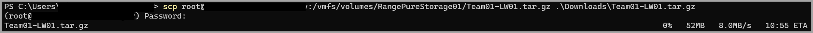

### Compress VMs for download  
Most VMware instances use a back-end storage solution like a SAN or NAS.  See [VMware Storage Location](#vmware-storage-location) for locating the datastore location.  
  
  

This command will compress the folder with the VM into a single file for download.    
```bash
tar -czvf /vmfs/volumes/RangePureStorage01/Team01-LW01.tar.gz /vmfs/volumes/RangePureStorage01/Team01-LW01
```  
  

Compress multiple folders into a single file  
```bash
tar -czvf /vmfs/volumes/drive/compressed-file.tar.gz /vmfs/volumes/drive/folderwithVM /vmfs/volumes/drive/folderwith2ndVM /vmfs/volumes/drive/folderwith3rdVM
```  

### Download files from ESXi  
```bash
scp root@esxiserver.fqdn.tld:/path/to/compressed-file.tar.gz localdownload\location\of\compressed-file.tar.gz
```  
  


### References  
#### [Linux Tar Command](https://www.howtogeek.com/248780/how-to-compress-and-extract-files-using-the-tar-command-on-linux/)  
#### [VMware Storage Location](https://vdc-repo.vmware.com/vmwb-repository/dcr-public/2bba164b-4115-4279-9c99-40f4c14319ad/03a845fc-5345-45de-9a27-31e868d6e751/doc/vddkDataStruct.5.2.html#:~:text=On%20ESX%2FESXi%20hosts%2C%20virtual,inventory%20for%20hosts%20and%20clusters.)  
#### [Copy files between ESXi Hosts](https://www.vmwarearena.com/how-to-copy-files-between-esxi-hosts-using-scp-command/)  
#### [SCP Remote to Local](https://linuxhint.com/scp-remote-to-local/)  
